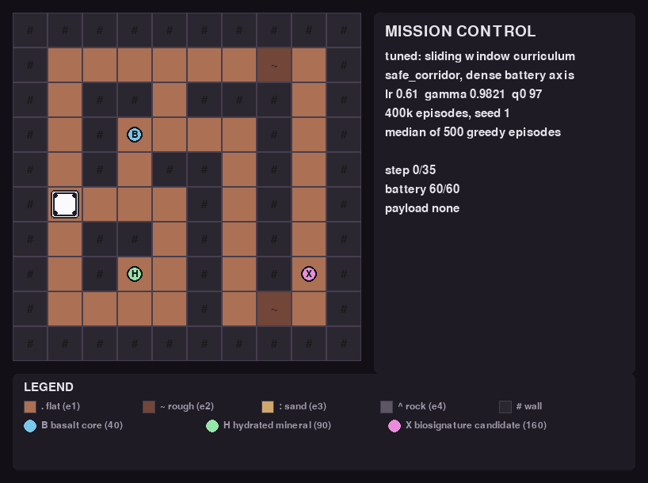

# Mars Sample Return — tabular Q-learning with a start-state curriculum



## TL;DR

Tabular Q-learning on a hand-written Mars sample-return MDP — up to 104,256 states × 5
actions — where a start-state curriculum is what makes a sparse reward learnable.

```bash
# 1. install
uv venv --python 3.12 && uv sync --extra dev

# 2. train the policy in the GIF above  (400,000 episodes, ~4m45s on one core)
python -m mars_rover_q.cli train --scenario safe_corridor --reward sparse --seed 1 \
    --episodes 400000 --learning-rate 0.6114 --gamma 0.9821 --initial-q 96.81 \
    --epsilon-start 0.627 --epsilon-end 0.00106 \
    --dense-battery --curriculum-fraction 0.5175 \
    --curriculum-strategy sliding --curriculum-window-fraction 0.0217 \
    --eval-episodes 500 --no-battery-figs

# 3. watch it fly, and look at what it learned
RUN=artifacts/runs/safe_corridor__sparse__seed1
python -m mars_rover_q.cli replay   --run $RUN --episode best --policy-overlay
python -m mars_rover_q.cli figures  --run $RUN
python -m mars_rover_q.cli evaluate --run $RUN --episodes 500
```

That run evaluates at **success 1.000, mean base return 160.000** over 500 greedy
episodes, delivering the 160-point biosignature in 500 of 500 — the optimum for this map.

`train` prints that summary when it finishes and writes the run directory itself;
`replay` opens the recorded episode in Pygame with the greedy policy drawn over the map;
`figures` writes the diagnostics into `$RUN/figs/`:

| File | What it shows |
|---|---|
| `figs/state_coverage.png` | how much of the table holds a value the trainer actually wrote, split by what was in the sample bay |
| `figs/experience_heatmaps.png` | Q-updates per cell, battery summed away, one panel per payload |
| `figs/q_by_battery/battery_NN.png` | one frame per battery level, each cell painted by its best action's value, with an arrow only where that action is unique |

`--no-battery-figs` above skips only the per-battery frames during training, since
`--dense-battery` makes 61 of them; step 3's `figures` draws the full set in about 35
seconds. Drop `--dense-battery` to train on the four-bin affordability axis
instead (1,600 rows rather than 24,400), and set `--curriculum-fraction 0` to see what the
same agent does with no curriculum at all.

---

## The mission

A rover lands on Mars with a finite battery and three reachable samples worth 40, 90 and
160 points. It can carry one. It has to bring it home. The mission is not *find the goal*
— it is *choose which goal is affordable* — and under a sparse reward that is a hard
exploration problem: the only non-zero signal arrives after a long, specific, risky
sequence of actions that a random walk essentially never completes.

This repository solves it with **tabular Q-learning and a start-state curriculum**, on a
hand-written MDP with no RL framework anywhere in the learning path. The curriculum is what
makes a table that size learnable: instead of starting every episode at the lander, training anneals
over start states the rover could *physically have driven itself into*, widening from easy
to hard while evaluation stays pinned to the canonical lander start.

**The headline result.** On `safe_corridor`, a 20-trial hyper-parameter search at a
400,000-episode cap produced 19 scored trials. Eighteen of them converge on the 90-point
sample and stop there. **One reaches the 160-point optimum and holds it — the
sliding-window start-state curriculum.** Its confirmation run scores a mean base return of
**160.000** at a **1.000** success rate over 500 greedy episodes, and retrained on three
seeds the search never saw it returns 159.998 / 159.993 / 159.998. The GIF above is that
policy: the median episode of a fresh 500-episode greedy batch, 35 steps, home with 22 of
60 battery left.

---

## The MDP

**State** — `(row, column, battery, carried_sample)`, with
`carried_sample ∈ {NONE, BASALT, HYDRATED_MINERAL, BIOSIGNATURE}`. The map is fixed within
a run, so position already implies terrain and terrain is deliberately not part of the
state.

**Actions** — `NORTH, SOUTH, EAST, WEST, COLLECT`. `COLLECT` succeeds only on a sample tile
with an empty bay, and a valid collection locks that payload for the episode.

**Transitions** — `FLAT`, `ROUGH`, `SAND` and `ROCK` are traversable at per-terrain energy
costs; `WALL` is not. Rough and sandy tiles may execute the commanded move, stall, or
deflect the rover 90°. **Every** attempted action costs energy — slips, deflections, wall
collisions and invalid collects included.

**Episode ends**

| Outcome | `terminated` | `truncated` | Base reward |
|---|---|---|---|
| delivered to the lander | ✅ | — | the sample's value (40 / 90 / 160) |
| battery depleted | ✅ | — | `-100` |
| step limit | — | ✅ | `-100` |

Delivery is checked before depletion, so arriving home on the last joule still counts.
Q-learning bootstraps across **neither** boundary.

**The battery axis.** Battery is exact in the environment but binned before it indexes a
table row. The default bins at each sample's *mission cost* — its lander round trip plus
the `COLLECT` charge, i.e. the exact charge below which that sample stops being
deliverable — which puts a boundary at every level where the affordable set changes and
none anywhere else. `--dense-battery` restores one row per reading.

| Scenario | Size | Battery | Rows (binned) | Rows (dense) | Curriculum pool |
|---|---|---|---|---|---|
| `safe_corridor` | 10×10 | 60 | 1,600 | 24,400 | 6,320 |
| `risk_value_tradeoff` | 12×12 | 70 | 2,304 | 40,896 | 14,298 |
| `shaping_trap` | 12×12 | 180 | 2,304 | 104,256 | 51,451 |

Either way the map onto rows is total: every integer in `range(num_states)` decodes to a
valid state, so the table has no padding rows.

**Rewards.** Three modes live in `rewards.py`, outside the agent: `sparse` (delivery or
failure only), `naive_dense` (sparse plus an asymmetric progress bonus, deliberately
exploitable), and `potential` (sparse plus `F = γ·Φ(s′) − Φ(s)` with `Φ = 0` in every
terminal state). `base_return` and `shaped_return` are separate fields everywhere — in
`info`, in `EpisodeRecord`, in the CSVs and in every plot — so a shaped agent is never
credited with its own shaping. **Every study in this repository used `sparse`**; the other
two modes are implemented and tested but have not been compared under an experiment.

---

## The start-state curriculum

A start state is admitted to the pool only if the rover could both have driven itself
there *and* still finish the mission from it: the cheapest itinerary explaining the state
is charged against the energy already missing, and the remaining battery must cover the
trip home. States are ranked by difficulty, and the anneal widens from the easy end onto
the canonical lander start, reaching it exactly at `progress = 1.0`.

A schedule has two independent knobs — which ranks are **admissible**, and how the draw is
**spread** over them — and `--curriculum-strategy` selects the combination:

| Strategy | Admits | Draws |
|---|---|---|
| `growing` (default) | the easiest `floor(N × progress)` states | uniformly |
| `sliding` | a fixed-width band whose edges both advance | uniformly |
| `visit_weighted` | the same band as `growing` | in inverse proportion to Q-updates already received |
| `exploring` | the whole pool, for the whole anneal | uniformly — the exploring-starts condition, not a schedule |

`visit_weighted` calls the same window helper `growing` does, so the comparison between
them isolates exactly one variable. It is also the only schedule here that closes a loop
on the table's own experience (`TrainResult.visit_counts`) rather than on the episode
counter.

Two properties make curriculum runs comparable with runs trained without one:

- **Evaluation never uses the curriculum.** `evaluate` always resets to the lander with a
  full battery.
- **Learning curves use canonical-start episodes only.** `EpisodeRecord.from_canonical_start`
  marks which episodes began at the lander, and every curve and threshold metric is
  computed from those alone.

The curriculum is **off by default** (`--curriculum-fraction 0.0`), so it is a condition
that has to be asked for rather than a silent change to the baseline.

---

## Install

```bash
uv venv --python 3.12
uv sync --extra dev
```

Or with plain `venv`:

```bash
python3.12 -m venv .venv && source .venv/bin/activate
pip install -e ".[dev]"
```

Runtime dependencies are `numpy`, `pygame` and `matplotlib`, plus `optuna` for the
hyper-parameter search. There is **no RL framework dependency** — no Gymnasium,
Stable-Baselines, RLlib, CleanRL or TorchRL — so the learning loop stays visible in
`src/mars_rover_q/training.py`.

---

## Usage

Every command is `python -m mars_rover_q.cli <command>`; the installed console script
`mars-rover-q` is equivalent.

| Command | What it does | Trains? |
|---|---|---|
| `scenarios` | List the bundled maps and their headline numbers | no |
| `play` | Drive the rover yourself in Pygame | no |
| `train` | Train one Q-table and write a run directory | yes |
| `evaluate` | Greedy-evaluate a saved run with exploration disabled | no |
| `replay` | Replay a recorded episode in Pygame | no |
| `figures` | Redraw a saved run's diagnostic figures | no |
| `curriculum` | Dry-run the start-state schedules without training | no |
| `experiment` | Run a grid of cells, then analyse and plot it | yes |
| `analyze` | Re-analyse and re-plot a finished experiment | no |
| `tune` | Optuna search over the agent and curriculum knobs | yes |

### Train

```bash
# One table, one seed, written to a run directory under artifacts/
python -m mars_rover_q.cli train --scenario safe_corridor --reward sparse --seed 1

# With the curriculum that produced the headline result
python -m mars_rover_q.cli train --scenario safe_corridor --reward sparse --seed 1 \
    --episodes 400000 --learning-rate 0.6114 --gamma 0.9821 --initial-q 96.81 \
    --epsilon-start 0.627 --epsilon-end 0.00106 \
    --dense-battery --curriculum-fraction 0.5175 \
    --curriculum-strategy sliding --curriculum-window-fraction 0.0217
```

The winning trial also decays epsilon over 64% of the budget, which `train` does not expose
as a flag; `tune --config configs/tuning/safe_corridor_search_deep.json` reproduces the
exact configuration, confirmation run included.

| Curriculum flag | Default | Applies to | Meaning |
|---|---|---|---|
| `--curriculum-fraction` | `0.0` (off) | all | Share of episodes the anneal runs over. `0.5` means the second half trains entirely from the lander. |
| `--curriculum-strategy` | `growing` | all | `growing`, `sliding`, `visit_weighted` or `exploring`. |
| `--curriculum-window-fraction` | `0.25` | `sliding` | Band width as a share of the pool. Smaller retires solved states faster. |
| `--curriculum-weight-exponent` | `1.0` | `visit_weighted` | Tilt strength. `0.0` is uniform, i.e. the control. |

A knob belonging to another strategy is accepted and ignored, so a sweep can pass one flag
set across every arm. `train` prints the schedule it actually ran, and every
`manifest.json` records it:

```
curriculum: strategy=sliding pool=6320 distinct_starts=6314 curriculum_episodes=206976
```

`--no-figs` skips the per-run figures; `--no-battery-figs` skips only the per-battery value
maps (four frames by default, 61 under `--dense-battery`).

### Evaluate, replay, redraw

```bash
python -m mars_rover_q.cli evaluate --run artifacts/runs/<run> --episodes 500
python -m mars_rover_q.cli replay   --run artifacts/runs/<run> --episode best
python -m mars_rover_q.cli figures  --run artifacts/runs/<run>
```

Evaluation disables exploration and draws from a seed set disjoint from training, so it
never replays the training stream. `replay`: `TAB` pauses, `.` single-steps, `[`/`]` change
speed. `play`: arrows or WASD drive, `SPACE` collects, `P` toggles the policy overlay.

`figures` writes `state_coverage.png` (how much of the table holds a value the trainer
actually wrote, split by payload), `experience_heatmaps.png` (Q-updates per cell, battery
summed away, one panel per payload) and `figs/q_by_battery/battery_NN.png` (one frame per
battery bin, each cell painted by its best action's value, with an arrow only where that
action is unique — a cell with no arrow has tied actions and a coin-toss greedy pick).

### Inspect a schedule without training

```bash
python -m mars_rover_q.cli curriculum --scenario risk_value_tradeoff
```

Enumerates the pool and replays the whole anneal against a synthetic visit counter,
reporting where the episodes actually land. About a second, and the fastest way to see what
a schedule change does.

### Experiments and search

```bash
# Curriculum vs no curriculum across five training budgets, 300 cells, 10 seeds
python -m mars_rover_q.cli experiment \
    --config configs/experiments/curriculum_budget_sweep.json --jobs 8

# Re-analyse and re-plot a finished grid without retraining anything
python -m mars_rover_q.cli analyze --summary artifacts/curriculum_budget_sweep/summary.json

# The hyper-parameter search that produced the headline result
python -m mars_rover_q.cli tune --config configs/tuning/safe_corridor_search_deep.json
```

`--jobs` changes only how fast a grid runs: cells are independent and every generator is
injected, so per-seed rows are identical at any worker count, and there is a test asserting
it. `configs/experiments/*_smoke.json` and `configs/tuning/smoke.json` are second-scale
versions for checking the plumbing first.

The search spends a fixed **episode ledger** rather than a fixed trial count: each trial is
granted its cap up front, a pruned trial returns what it did not spend, and the study stops
when what remains cannot fund another full trial. It maximises one scalar — the normalised
area under the learning curve, which rewards both height and earliness — and reports the
two-objective Pareto front separately, so the trade-off the scalar resolves stays visible.

---

## Testing

```bash
ruff format --check . && ruff check . && mypy && pytest
```

All four gates pass. The fast inner loop is `pytest -m "not slow and not human_todo"`
(~12 s against the full suite's ~80 s); keep both clauses, since a command-line `-m`
replaces the configured default instead of combining with it. Current state: **533 passed,
166 deselected**, plus **166 passed** in the teaching suite
(`pytest -m human_todo tests/human_todo`), `mypy` clean over 52 files.

---

## Architecture

```
src/mars_rover_q/
├── actions.py      Action enum, movement deltas, 90° deflections
├── state.py        RoverState and the StateEncoder, including the binned battery axis
├── scenario.py     JSON loading, validation, Dijkstra distances, mission costs
├── environment.py  the MDP: transitions, termination, info, episode statistics
├── rewards.py      the three reward modes (outside the agent, by design)
├── agent.py        the Q-learning core and the epsilon schedule
├── curriculum.py   reachable start states and the four draw strategies
├── training.py     the visible Q-learning loop
├── evaluation.py   greedy evaluation and trajectory capture
├── metrics.py      episode records, summaries, confidence intervals, paired differences
├── plots.py        matplotlib figures with uncertainty bands
├── run_figures.py  per-run coverage and experience figures
├── experiment.py   the grid, run serialisation, aggregation
├── sweep.py        budget curves and first-crossing budgets
├── tuning.py       the Optuna search: ledger, search space, objective, Pareto front
├── numerics.py     the floating-point error policy
├── renderer.py     Pygame mission control, manual play, replay
└── cli.py          the commands above
```

Dependencies run one way: `scenario → state/actions`, `curriculum → scenario + state`,
`environment → scenario + rewards`, `training/evaluation → environment + agent +
curriculum`, `experiment → training + evaluation + plots`, `tuning → training + evaluation
+ experiment`. Nothing in the learning path imports `renderer` or `run_figures`, and
`optuna` is imported only inside `tuning`'s study functions.

---

## Results

Every number below is read from a generated `study.json`, `summary_aggregated.csv` or
`sweep_analysis.json`. Runs are seeded end to end: `split_rngs(seed, 3)` derives
independent environment, agent and start-state generators from one integer, evaluation uses
a disjoint seed set at `epsilon = 0`, and every run directory carries a manifest with the
config, the seeds, the package versions and the git commit.

### The curriculum is what reaches the optimum on `safe_corridor`

Hyper-parameter search, sparse reward, six agent knobs plus the battery encoding and the
curriculum searched together, seeded TPE sampler with a median pruner:

| Cap per trial | Scored trials | Trials ending at 90 | Trials ending at 160 |
|---|---|---|---|
| 150,000 | 24 | 23 (the 24th at 40) | **0** |
| 400,000 | 19 | 18 | **1 — `sliding`, fraction 0.518, window 0.0217** |

Four trials at the 400k cap *touch* 160 at some checkpoint; three of them fall back to 90
and only the sliding-window curriculum holds it. Its confirmation run — retrained and
evaluated over 500 greedy episodes from the lander, shaping excluded — scores **160.000**
mean base return at a **1.000** success rate in 36.3 steps, against a planning bound of
160.0. Retrained on seeds 2, 3 and 4, which the search never saw, it scores 159.998,
159.993 and 159.998 — those three by exact backward induction on the true MDP, which is
tractable here because every traversable tile costs at least one energy, so the state graph
is a DAG ordered by battery. *That solver is a one-off analysis script and is not part of
this repository; every other number on this page is reproducible from committed code.*

### The curriculum rescues `shaping_trap` outright

300-cell grid: 3 maps × 5 training budgets × {curriculum 0.5, none} × 10 seeds, sparse
reward, 2.34M training episodes in 7 min 3 s at `--jobs 8`. Arms of a seed share their RNG
streams, so the statistic is the **within-seed paired difference** in evaluation mean base
return, with a 95% CI across 10 pairs:

| Scenario | 1,000 | 3,000 | 5,000 | 10,000 | 20,000 |
|---|---|---|---|---|---|
| `shaping_trap` | +0.60 [−0.26, +1.45] | +0.95 [−0.07, +1.97] | **+3.25 [+1.50, +5.00]** | **+138.69 [+122.14, +155.25]** | **+173.81 [+153.86, +193.76]** |
| `safe_corridor` | +38.00 [−4.77, +80.78] | 0.00 [−16.86, +16.86] | +5.00 [−6.31, +16.31] | 0.00 [0.00, 0.00] | +5.00 [−6.31, +16.31] |
| `risk_value_tradeoff` | 0.00 | 0.00 | 0.00 | 0.00 | 0.00 |

At 20,000 episodes on `shaping_trap` the curriculum arm evaluates at **75.51**
[55.71, 95.32] against **−98.30** [−99.36, −97.24] without it, at a 0.941 success rate
against 0.010. **Ten of ten seeds** reach the 0.8 success threshold with the curriculum and
**zero of ten** without, so the baseline's budget is reported as *did not reach* rather
than as a number.

On `safe_corridor` every paired interval at these budgets straddles zero — at 20k episodes
and untuned hyper-parameters, this grid finds no effect there; the 400k search above is
where that map separates. On `risk_value_tradeoff` both arms sit at exactly 40.00 at every
budget: under these settings neither ever learns to deliver anything but the basalt, which
is a ceiling in the experiment rather than a tie between the arms.

### Where the curriculum is not the answer

The same search run on the other two maps, at a 150,000-episode cap, picks **no curriculum
at all** and gets its exploration from optimistic initialisation instead — a large
`initial_q` paired with a low, fast-decaying epsilon:

| Map | Best mean base return | Success | lr | γ | `initial_q` | Curriculum |
|---|---|---|---|---|---|---|
| `risk_value_tradeoff` | 158.960 | 0.996 | 0.0763 | 0.9839 | 97.3 | none |
| `shaping_trap` | 160.000 | 1.000 | 0.1905 | 0.9143 | 188.9 | none |

Both are within 0.6% of the 160.0 planning bound. Read together with the grid above: the
curriculum is decisive when the budget is small relative to the exploration problem, and
optimistic initialisation can substitute for it when the budget is large.

One failure mode is worth naming because the objective is behaving correctly and the result
is still wrong. At a 150k cap on `safe_corridor`, 21 of 25 trials chose γ below 0.97 — out of
a search range running to 0.9995, and low enough that converging on the 90-point sample is
the *correct* answer to the discounted problem. The winner then solved that mission
perfectly: 500 of 500 greedy deliveries in 13 steps, of the wrong sample. Raising the cap
to 400k dissolved it. The cap and the discount range have to be chosen as a pair.

---

## Limitations

- **Simplified physics.** A four-neighbour grid step with a categorical slip model. No
  continuous dynamics, no terramechanics, no sensor noise.
- **Full observability.** The rover knows its exact position, battery and payload.
  Localisation error is the first thing that would break the tabular formulation.
- **One map per table.** The row IDs refer to specific cells with specific terrain, so a
  table trained on one scenario is meaningless on another. Every `(scenario, reward mode,
  seed)` cell trains a fresh table, and nothing here claims to generalise to an unseen map.
- **Sampling, not planning.** The MDP is small enough to solve exactly. Q-learning is used
  because the question is about learning dynamics; the exact solutions are what the learned
  policies are measured against.
- **Sparse reward only.** `naive_dense` and `potential` are implemented and tested but have
  not been run as a comparison, so no claim is made about them.

---

## License

MIT.
